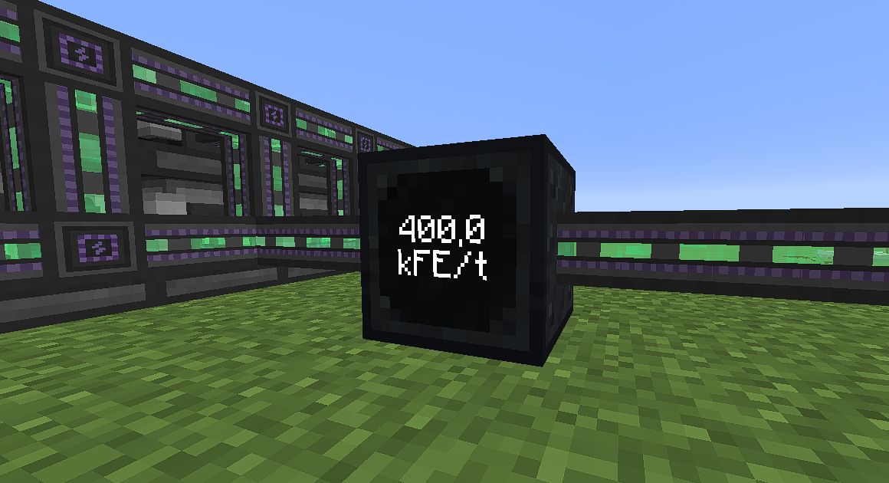
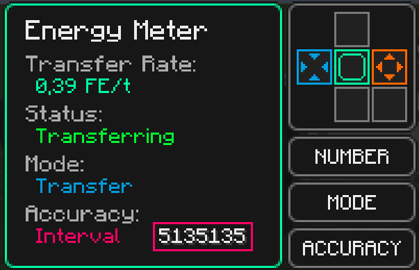

<h1>Energy Meter</h1>

A [Minecraft] mod to easily measure your energy rates.

[![Version][version_badge]][version_link]
[![Total Downloads][total_downloads_badge]][curseforge]
[![Workflow Status][workflow_status_badge]][workflow_status_link]
[![License][license_badge]][license]
[![Style][style_badge]][style_link]

[Discord] | [CurseForge]

## **📑 Overview**
This is a mod for [Minecraft] [Forge]. 
It adds a simple block you can use for measuring energy transfer rates.

It has a screen always displaying the current rate in order to keep you up-to-date.

    

        <strong>Preview</strong> (click to expand)
    

 

## **🔧 Installation**
1. Download the latest **mod jar** from the [releases] or from [CurseForge].
2. Install Minecraft [Forge].
3. Drop the **jar file** into your mods folder.

## **✋ Usage**
The usage of the Energy Meter is pretty straight-forward. 
Just connect wires, generators, machines or other electrical objects to the Meter and take a look at the energy transfer rate.

The block itself has a GUI where you can look at extended number information, change its mode or adjust the side configuration of the Meter.

## **⚙ Functionality**
The Energy Meter can only have one input but a maximum of 4 outputs. 
All sides can be configured except for the front because that's the reserved face for the screen.

If you have multiple outputs, the Meter will always try to equally split the energy between all of them. 
Additionally, the Meter has two modes:

**Transfer Mode**
- the default mode
- will transfer the incoming energy to the defined outputs just like a cable with the benefit of it measuring the rate

**Consumer Mode**
- will take priority over all outputs
- dumps all incoming energy (acts like a trashcan)
- useful if you want to measure all incoming energy without the need to transfer it somewhere

The Energy Meter recalculates the transfer rate every 5 ticks (0,25 seconds). 
It has an unlimited transfer rate. Therefor, the limitation only comes from the attached objects. 
To prevent having an unlimited cable very early, it is not possible to attach a Meter to another Meter.

There are some mods with pretty unique implementations of cables like Pipez. 
The mod currently has a workaround for that but in case you find other mods which don't work properly with the Meter, please report them!

## **📕 History**
The inspiration to create this mod came from the awesome [Energy Meters] mod in Minecraft 1.12.2. 
It was never updated, and we always liked a proper way to measure our energy usages.

Energy Meter is a complete rewrite and also has different features. It's not really comparable to the original mod anymore and just follows the same idea.

## **📑 Credits**
Since this is no official update nor a port of the mod, it's pretty much a standalone thing. 
But I want to give credit to the original author [@vladmarica] for this cool idea.

## **⏰ Changelog**
Everything related to versions and their release notes can be found in the [changelog].

## **🎓 License**
This project is licensed under the [MIT license][license].

<!-- Badges -->
[version_badge]: https://img.shields.io/github/v/release/RLNT/minecraft_energymeter?style=flat-square
[version_link]: https://github.com/RLNT/minecraft_energymeter/releases/latest
[total_downloads_badge]: http://cf.way2muchnoise.eu/full_532169.svg?badge_style=flat
[workflow_status_badge]: https://img.shields.io/github/workflow/status/RLNT/minecraft_energymeter/CI?style=flat-square
[workflow_status_link]: https://github.com/RLNT/minecraft_energymeter/actions
[license_badge]: https://img.shields.io/github/license/RLNT/minecraft_energymeter?style=flat-square
[style_badge]: https://img.shields.io/badge/code_style-prettier-ff69b4.svg?style=flat-square
[style_link]: https://github.com/prettier/prettier

<!-- Links -->
[minecraft]: https://www.minecraft.net/
[discord]: https://discordapp.com/invite/Q3qxws6
[curseforge]: https://www.curseforge.com/minecraft/mc-mods/energymeter
[forge]: http://files.minecraftforge.net/
[releases]: https://github.com/RLNT/minecraft_energymeter/releases
[Energy Meters]: https://www.curseforge.com/minecraft/mc-mods/energy-meters
[@vladmarica]: https://github.com/vladmarica
[changelog]: CHANGELOG.md
[license]: LICENSE
